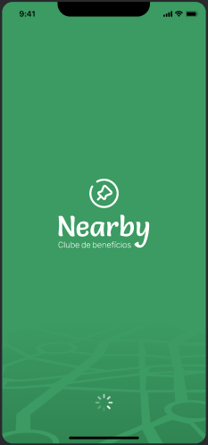

<p align="center">
  
</p>

O projeto é um aplicativo mobile de clube de benefícios com cupons para utilizar em estabelecimentos próximos a você.

Este é um projeto do evento NLW Pocket Mobile, um dos conteúdos disponíveis para alunos da [Rocketseat](https://www.rocketseat.com.br/).

Indice do repositório
=
* [Pré-requisitos](#pre-requisitos)
* [Instalação](#instalacao)
* [Pré Visualização](#pre-visualizacao)
* [Créditos](#creditos)

## Pré-Requisitos
Para uma execução correta do projeto certifique-se de que seu ambiente de desenvolvimento contenha:
  - [NodeJs](https://nodejs.org/en) v22.11.0 ou superior.
  - [Expo](https://expo.dev/tools#cli) v52.0.18 ou superior.
  - [Nearby - API](https://github.com/Igor2502/nearby-api)

## Instalação
Após clonar o projeto é necessário seguir os seguintes passos:

 - Instalar as dependências
```bash
npm install
```
  - Executar a aplicação:
```bash
npx expo start
```

Caso tenha seguido corretamente os passos anteriores sua aplicação já estará disponível para ser executada no emulador ou no próprio dispositivo físico.

## Pré Visualização
Para acessar o layout completo acesse do app acesse o [Figma](https://www.figma.com/design/LOBrmBDSK8pYSvUvBGMre8/NLW-Pocket-Mobile-%E2%80%A2-Nearby-(Community)?node-id=0-1&p=f&t=qWMFXT6kvj8RoGag-0) do projeto.

<h1 align="center">
  
  
  
</h1>

## Créditos
Feito pela [Rocketseat](https://www.rocketseat.com.br/).